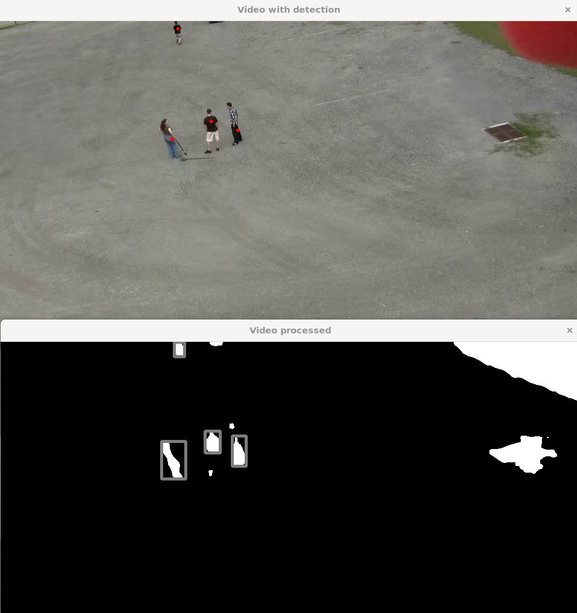

# Description
Simple example of opencv use in C++ for rule-based object detection on a particular video. 

In this case, I’m detecting people. This approach likely wouldn’t work for most other videos, since the filters are tailored to this specific one, and the people’s silhouettes are highlighted by the uniform background. 

# How to run

#### Opencv installation:
```bash
sudo apt install libopencv-dev
```

#### Build and run:
```bash
make           # Builds the project
./main         # Runs the executable
```

#### Clean:
```bash
make clean     # Cleans up build files
```

# Example
Original video:
<video width="960" height="540" controls>
  <source src="./data/actions2.mpg" type="video/mpg">
  Your browser does not support the video tag.
</video>


# Credits
Video is from [UCF Aerial Action Data Set](https://www.crcv.ucf.edu/data/UCF_Aerial_Action.php)